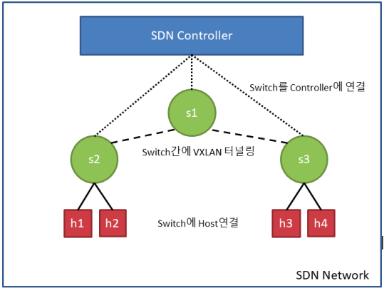

# WICE - Docker Container Management in SDN
**본 프로젝트는 2019 공개 소프트웨어 개발자 대회 WICE팀의 프로젝트입니다.**

### Introduction 
**Docker Container Management in SDN**

Software Defined Network(SDN) Controller인 ONOS를 이용해서 전체 네트워크 토폴로지를 관리하고, open vSwitch에서 제공하는 VxLAN터널링 기능을 통하여 호스트간의 통신을 가능하게 합니다. 

* 본 프로젝트는 도커를 통해 만들어진 컨테이너를 관리하기 위한 플랫폼을 제공하고자 합니다.
* 또한 SDN Controller에서 제공하는 UI를 통해서 사용자는 전체 네트워크 토폴로지를 확인할 수 있습니다.
* UI에 있는 이름을 통해 다른 사용자의 컨테이너 또한 확인이 가능합니다.

### Excute Project
1. onos controller 설치
2. container Manager Server 설치
3. 각 Host 설치
4. Manager와 Host 사이에 VXLAN 연결

###### onos controller
1. onos_install.sh 실행
2. onos 폴더로 들어가서 start-onos.sh 실행
3. app activate org.onosproject.fwd
   app activate org.onosproject.openflow
4. [controller_ip]:8181/onos/ui 웹 페이지 접속

###### Container Manager Server
1. sudo 권한으로 docker-install.sh 실행
2. sudo ovs-vsctl show 확인 ( controller에 is_connected: true 표시가 나타나는 경우 성공 )

###### Host
1. sudo 권한으로 docker-install.sh 실행
2. sudo 권한으로 make-ovs 실행
3. sudo ovs-vsctl show ( 매니저와 동일 )
4. sudo docker ps ( 컨테이너 목록 확인 )

###### VXLAN 연결 ( 호스트-호스트간에 통신 연결 )
1. vxlan.sh 실행 ( 실행 방법은 ./vxlan.sh [vxlan별칭] [상대방 호스트 ip])
ex) ./vxlan.sh vxlan0 192.168.172.111
2. sudo ovs-vsctl show ( vxlan port 생성이 되었는지 확인 )

###### VXLAN 주의사항
###### 매니저=102 / 호스트=111/112 인 경우
1. 매니저와 호스트들을 연결
2. 102-111 연결
3. 102-112 연결
4. 매니저가 중앙에서 관리

# Setting Initialize
sudo 권한으로 Initialize.sh 실행

자세한 사항은 utils 파일 안에 설치 및 실행 동영상을 확인하거나 [manual.txt](../manual.txt)를 확인하시기 바랍니다.

### License
Apache License

Version 2.0, January 2004

<http://www.apache.org/licenses/>

_All the codes in this project folder is covered by the LICENSE file. Please refer to the LICENSE for details._

### Enviroments and Language

Enviroments | Version |URL
--------- | ---------|--------- |
OS | Ubuntu 18.04.2 Server | -
Controller | ONOS 1.13 | <https://wiki.onosproject.org>
Virtual Switch | Open vSwitch 2.9+ | <http://www.openvswitch.org/>
Docker | Docker 18.09+ | <https://docs.docker.com/>
Language | Shell Scripts | -

### System configuration and architecture

* **SDN Controller** : 전체 네트워크를 관리하며 앱을 통해서 여러 가지 기능 제공

* **SDN Switch** (S1, S2, S3) : SDN Controllr와 연결하여 구성 요소가 되며, 스위치간에는 통신을 위해 VxLAN 터널링을 사용 ( 실제 Host PC 자원 )

* **Host** (h1, h2, h3, h4) : open vSwitch를 이용하여 스위치와 연결되어 있으며, 스위치를 통해서 다른 스위치의 컨테이너와 통신이 가능 ( 컨테이너 )

### Project Features
1. SDN Controller 이용하여 전체 토폴로지 관리
2. 호스트들을 SDN Controller에 연결
3. 스위치를 통해 새로운 네트워크 영역을 할당
4. VXLAN 터널링을 통해 호스트 연결
5. 컨테이너 생성 및 스위치에 연결

### Applications Field
- SDN 컨트롤러 UI를 통해 전체 네트워크 토폴로지를 관리함으로써 호스트 및 컨테이너를 관리할 수 있고, 다른 사용자들의 시스템을 참고할 수 있습니다.

- 회사 부서, 연구실, 팀 프로젝트 등 소규모의 네트워크에서 실시간으로 사용자들 간에 서로의 정보를 공유함에 따라 시스템 구축에 드는 비용 및 시간을 절약할 수 있을 것입니다..

### Etc.
자세한 사항은 [manual.txt](../manual.txt) / [ref.txt](../ref.txt) 참고하시기 바랍니다.

